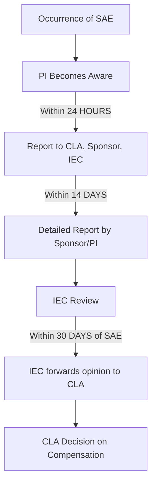

# SURTAMIND Team B Research Report — Regulations, Ethics & Compliance

## Executive Summary
This document provides a comprehensive regulatory, ethical, and compliance blueprint for clinical trials in India, specifically focusing on Ayurveda, Siddha, and Unani (ASU) medicines. It synthesizes the requirements set forth by the Drugs and Cosmetics Act (1940), the New Drugs and Clinical Trials (NDCT) Rules (2019), Good Clinical Practice (GCP), and the Ministry of Ayush. The objective is to guide the SUTRAMIND platform in integrating necessary compliance checkpoints, forms, and workflows.

---

## MODULE 1: Indian Regulatory Framework

### 1.1 Drugs & Cosmetics Act, 1940
The Drugs and Cosmetics Act (D&C Act), 1940 is the primary legislation regulating the import, manufacture, distribution, and sale of drugs and cosmetics in India. 

**How ASU (Ayurveda, Siddha, Unani) drugs are classified:**
Under Chapter IV-A of the D&C Act, Ayurvedic, Siddha, and Unani drugs are regulated. 
- **Classical Formulations:** Manufactured strictly according to the formulations described in the authoritative books of Ayurveda, Siddha, and Unani (Schedule I of the Act). These generally do not require extensive phase-wise clinical trials for licensing if used for their traditional indications.
- **Proprietary/Patent Medicines (Section 3(h)):** Formulations containing ingredients mentioned in Schedule I books but formulated in new combinations or formats. These require safety and efficacy data (clinical trials) to be submitted to the licensing authority for approval.

**Licensing Authorities & Regulation:**
- **State Licensing Authorities (SLAs):** Grant manufacturing and marketing licenses for ASU drugs within their respective states.
- **Ministry of Ayush:** At the central level, the Ministry of Ayush creates policies, issues directives, and governs the overall regulation of ASU drugs.
- **ASU Drugs Technical Advisory Board (ASUDTAB):** The statutory body advising the government on technical matters regarding ASU drugs.

**What is considered a 'new drug' in Ayurveda?**
A "New Drug" in the context of Ayush includes:
- Novel formulations using plant extracts or modified extraction processes not mentioned in classical texts.
- Classical formulations being investigated for a new therapeutic claim (indication) not mentioned in Schedule I.
- New dosage forms (e.g., converting a classical churna into an IV infusion or a prolonged-release tablet).

### 1.2 NDCT Rules, 2019 (MOST IMPORTANT)
The New Drugs and Clinical Trials Rules, 2019 completely overhauled the clinical trial landscape in India.

**Objectives and scope:**
To ensure faster approvals, improved transparency, ethical conduct, and stringent protection (and compensation) for human subjects.

**Clinical Trial Approval Process (Chapter V):**
Applications for clinical trials must be submitted via the SUGAM portal to the Central Licensing Authority (CLA). For modern medicine, the CLA is CDSCO. For ASU drugs requiring formal CT for cross-system validation, the Ministry of Ayush acts as the regulatory nodal body alongside SLA.

**Academic Clinical Trials (Rule 28):**
Trials conducted for academic or research purposes that do not intend to submit data to the regulator for marketing authorization. These do not require CLA approval, provided the Institutional Ethics Committee (IEC) approves them.

**Investigator-Initiated Trials (IIT):**
Trials conceived and conducted by an investigator independently. The investigator acts as both the sponsor and the investigator, assuming all regulatory and ethical responsibilities.

**Table: Key NDCT Rules & Practical Meanings**

| Topic | Relevant Rule | Practical Meaning |
| :--- | :--- | :--- |
| **Ethics Committee Registration** | Chapter III, Rule 7 & 8 | IECs must be registered with the CLA (CDSCO/DHR) and must review protocols prior to study initiation. |
| **Academic Trials** | Chapter V, Rule 28 | No formal approval needed from CLA if the trial is strictly academic and approved by IEC. |
| **Compensation for Injury/Death** | Chapter VI, Rule 39, 40 | Sponsors must provide medical management and financial compensation for trial-related injury/death. Formula-based compensation applies. |
| **SAE Reporting** | Chapter V, Rule 42 | Serious Adverse Events must be reported by the Investigator to the CLA, Sponsor, and IEC within 24 hours of occurrence. |
| **Informed Consent** | Chapter V, Rule 44 | Mandatory A/V recording of consent for vulnerable subjects in specific trials. |

### 1.3 CDSCO & Ministry of Ayush

**CDSCO (Central Drugs Standard Control Organisation):**
The national regulatory body for pharmaceuticals (allopathic/modern medicine) and medical devices. Headed by the Drugs Controller General of India (DCGI).

**Ministry of Ayush:**
The apex body regulating Ayurveda, Yoga & Naturopathy, Unani, Siddha, and Homoeopathy. 
- **Difference:** CDSCO approves modern chemical/biological drugs and their trials. Ayush approves and regulates traditional medicine systems.
- **Regulatory Interaction:** When an ASU drug seeks modern scientific validation, guidelines from both the Ministry of Ayush (GCP for ASU drugs) and ICMR ethical guidelines come into play. SLAS under the Ayush ministry issue manufacturing licenses for Ayurvedic proprietary medicines based on clinical trial data.

---

## MODULE 2: Good Clinical Practice (GCP)

### 2.1 What is GCP?
GCP is an international ethical and scientific quality standard for designing, conducting, recording, and reporting trials that involve human subjects.
- **History:** Emerged from the Declaration of Helsinki and ICH (International Council for Harmonisation) guidelines to prevent unethical human experimentation.
- **Indian GCP vs International:** Indian GCP guidelines (by CDSCO) are aligned with ICH-GCP but include India-specific requirements (e.g., stricter compensation rules, specific vulnerable population safeguards).
- **GCP for ASU Drugs:** Ministry of Ayush has published tailored "Good Clinical Practice Guidelines for Clinical Trials in Ayurveda, Siddha and Unani Medicine." It emphasizes the holistic nature of Ayush, standardization of raw materials (prakriti assessment, classical diagnostic parameters), and ethical adaptations for traditional formulations.

**13 Core Principles of GCP (Simplified):**
1. Ethics override science.
2. Benefits must outweigh risks.
3. Protect subjects' rights and safety.
4. Adequate non-clinical and clinical data must support the trial.
5. Follow a scientifically sound, detailed protocol.
6. Adhere strictly to the approved protocol.
7. Medical decisions must be made by qualified physicians (or qualified Vaidyas for Ayurveda).
8. All staff must be qualified by education, training, and experience.
9. Obtain freely given Informed Consent from every subject.
10. Ensure accurate recording, handling, and storage of trial data.
11. Protect confidentiality and privacy of subjects.
12. Manufacture/store investigational products according to GMP.
13. Implement systems for quality assurance.

### 2.2 Roles & Responsibilities (RACI Matrix)
R = Responsible (Does the work), A = Accountable (Final decision), C = Consulted, I = Informed

| Task | Sponsor | Principal Investigator (PI) | Sub-Investigator | CRC (Coordinator) | CRA (Monitor) | IEC |
| :--- | :--- | :--- | :--- | :--- | :--- | :--- |
| **Protocol Design** | R, A | C | I | I | I | C |
| **Ethics Approval** | I | R, A | C | R | I | R, A |
| **Informed Consent** | I | A | R | R | I | I |
| **Conducting Trial** | I | A | R | R | I | I |
| **Source Data Verification** | I | I | I | I | R, A | I |
| **SAE Reporting** | R | R, A | R | R | C | I |
| **TMF Maintenance** | R, A | I | I | I | R | I |

### 2.3 Monitoring & Quality Assurance
- **Site Monitoring & Source Data Verification (SDV):** The process where a monitor checks the eCRF (electronic Case Report Form) against the original source documents (patient files, lab reports) to ensure 100% accuracy.
- **Risk-Based Monitoring (RBM):** Focuses monitoring efforts on high-risk data points and processes (e.g., primary endpoints, safety data) rather than 100% SDV, optimizing costs and time.
- **Monitoring Visit Reports:** Document the findings of Site Initiation Visits (SIV), Routine Monitoring Visits (RMV), and Close-Out Visits (COV).
- **CAPA (Corrective and Preventive Action):** A process to investigate deviations, identify root causes, correct the issue (Corrective), and implement systemic changes to prevent recurrence (Preventive).

### 2.4 Audit & Inspection
- **Audit (Internal/Independent):** Conducted by the Sponsor's QA department or third-party auditors. It ensures the trial complies with the protocol, SOPs, and GCP. *Finding Example:* "Investigator forgot to sign 3 pages of the eCRF."
- **Inspection (Regulatory):** Conducted by Regulatory Authorities (e.g., CDSCO, FDA). *Finding Example:* Regulatory warning letter for failure to report an SAE within 24 hours, which may halt the trial.

---

## MODULE 3: Ethics & Human Subject Protection

### 3.1 Institutional Ethics Committee (IEC)
The IEC protects the mental and physical welfare, rights, and safety of human subjects.
- **Composition:** Multidisciplinary, 7-15 members.
- **Required Roles:** Chairperson (must be from outside the institution to maintain independence), Member Secretary (from the institution), Basic Medical Scientist, Clinician, Legal Expert, Social Scientist/NGO representative, Layperson.
- **Quorum:** Minimum 5 members required to vote (must include a basic medical scientist, clinician, legal expert, social scientist, and layperson).
- **Registration:** Must be registered with the Central Licensing Authority under Rule 8 of NDCT 2019.

### 3.2 Ethics Approval Workflow
1. **Protocol Submission:** PI submits protocol, ICF, IB, and CVs to IEC.
2. **Scientific Review:** Subject matter experts review scientific validity.
3. **Ethics Review:** Full board meeting assesses ethical implications, risks, and compensation.
4. **Revision:** IEC requests clarifications or amendments.
5. **Approval Letter:** Issued only when all queries are addressed.
6. **Continuing Review:** Annual/periodic review of trial progress.
7. **Final Closure:** PI submits final study report; IEC formally closes the study.

### 3.3 Informed Consent
**What is it?** A process (not just a form) by which a subject voluntarily confirms their willingness to participate after being informed of all aspects of the trial.
**Mandatory ICF Checklist (Rule 44):**
- [ ] Purpose of the research
- [ ] Experimental nature of the treatment
- [ ] Expected risks and discomforts
- [ ] Expected benefits
- [ ] Alternative treatments available
- [ ] Confidentiality of records
- [ ] Compensation for injury/death (explicitly stating rules)
- [ ] Right to withdraw at any time without penalty
- [ ] Contact details of PI and IEC

**Special Requirements:**
- **Illiterate participants:** Require a Legally Acceptable Representative (LAR) and an Impartial Witness to sign.
- **Audio-Video Consent:** Mandatory in India for vulnerable subjects in new chemical entity trials or when specifically mandated by the IEC.

### 3.4 Vulnerable Participants
Require heightened protection to avoid coercion or undue influence.
- **Children:** Require assent (child's agreement) + LAR consent (parents).
- **Pregnant Women:** Excluded unless the trial specifically addresses pregnancy-related conditions. High risk of teratogenicity.
- **Elderly:** Risk of polypharmacy and cognitive decline; carefully assess decision-making capacity.
- **Tribal Populations:** Community consent/approval from local leaders may be necessary alongside individual consent.

### 3.5 Protocol Amendments
Any change to the approved protocol.
- **Ethics Approval:** Substantial changes (affecting safety, endpoints, or study procedures) require formal IEC approval before implementation. Minor administrative changes only require notification.
- **Re-consenting:** If an amendment alters the risk-benefit ratio (e.g., a new side effect is discovered), all enrolled participants must be re-consented using an updated ICF.

---

## MODULE 4: Safety & Pharmacovigilance

### 4.1 AE vs SAE
| Feature | Adverse Event (AE) | Serious Adverse Event (SAE) |
| :--- | :--- | :--- |
| **Definition** | Any untoward medical occurrence in a patient. | An AE that meets specific severity criteria. |
| **Criteria** | Mild fever, headache, minor rash. | Results in Death, Life-threatening, Requires Hospitalization, Prolongs Hospitalization, Results in Disability, or Congenital Anomaly. |
| **Reporting** | Recorded in CRF, analyzed at end of study. | **Expedited reporting required.** |

### 4.2 SAE Reporting Workflow & Timelines (NDCT Rules)

### 4.3 PvPI & Ayurveda Pharmacovigilance
- **PvPI:** The Pharmacovigilance Programme of India, coordinated by the Indian Pharmacopoeia Commission (IPC). Focuses on modern drugs.
- **Ayush PV:** The Ministry of Ayush runs the Pharmacovigilance Initiative for Ayurveda, Siddha, Unani, and Homoeopathy drugs. The National Pharmacovigilance Centre (NPvCC) is at AIIA, New Delhi.
- **SUTRAMIND Integration:** SUTRAMIND can build an automated e2b XML safety reporting module that maps directly to the VigiFlow system used by PvPI/Ayush for seamless digital ADR submissions.

### 4.4 Compensation & Medical Management
Under NDCT Rules (Chapter VI):
- **Medical Management:** Sponsor must provide free medical management as long as required for the SAE.
- **Financial Compensation:** If the injury/death is proven to be related to the clinical trial (e.g., adverse effect of investigational product, protocol failure), the sponsor must pay financial compensation based on a formula dictated by the CLA.

---

## MODULE 5: CTRI Registration & Regulatory Documentation

### 5.1 CTRI (Clinical Trials Registry – India)
- **Purpose:** A free, online, public record system hosted by ICMR. It ensures transparency, prevents publication bias, and promotes ethical research.
- **Mandatory Registration:** Every clinical trial must be registered prospectively (before enrolling the first patient). Retrospective registration is heavily penalized and flagged.
- **Format:** CTRI/YYYY/MM/XXXXXX

### 5.2 Essential Regulatory Documents
- **Protocol:** The blueprint of the study (objectives, design, methodology, stats).
- **Investigator Brochure (IB):** Compilation of clinical and non-clinical data on the investigational product (for Ayurveda, this includes classical literature, previous clinical data, and toxicology).
- **Ethics Approval:** Formal written authorization from IEC.
- **Informed Consent Form (ICF):** The document signed by the subject.
- **Insurance:** Certificate proving the sponsor has clinical trial liability insurance to cover compensation.
- **Clinical Trial Agreement (CTA):** Legal contract between Sponsor, CRO, and Investigator/Institution detailing finances and responsibilities.

### 5.3 Trial Master File (TMF)
- **Definition:** The collection of essential documents that permits evaluation of the conduct of a trial and the quality of data produced.
- **Archiving:** NDCT rules require TMF to be archived securely for at least 5 years after study completion (or longer based on sponsor SOPs).
- **Inspection Readiness:** The TMF must always be updated and accessible during audits.

---

## Glossary of 20 Core Compliance Terms

1. **NDCT (New Drugs and Clinical Trials Rules):** The 2019 legislation governing Indian clinical trials.
2. **CDSCO:** Central Drugs Standard Control Organisation.
3. **DCGI:** Drugs Controller General of India.
4. **GCP:** Good Clinical Practice.
5. **IEC:** Institutional Ethics Committee.
6. **ICF:** Informed Consent Form.
7. **SAE:** Serious Adverse Event.
8. **AE:** Adverse Event.
9. **ADR (Adverse Drug Reaction):** An AE where a causal relationship with the drug is suspected.
10. **Sponsor:** Individual or company that takes responsibility for initiating and financing a clinical trial.
11. **PI (Principal Investigator):** The lead doctor responsible for the clinical trial at a site.
12. **Monitor (CRA):** Person assigned by the sponsor to oversee trial progress.
13. **CAPA:** Corrective and Preventive Action.
14. **Audit:** Independent, internal evaluation of trial conduct.
15. **Inspection:** Official review by regulatory authorities.
16. **TMF (Trial Master File):** Central repository of all essential trial documents.
17. **CTRI:** Clinical Trials Registry - India.
18. **Protocol Amendment:** Formal change to the trial protocol.
19. **Vulnerable Subject:** Individuals whose willingness to volunteer may be unduly influenced.
20. **Compensation:** Financial payment given to subjects for trial-related injury or death.

---
*End of Report*
